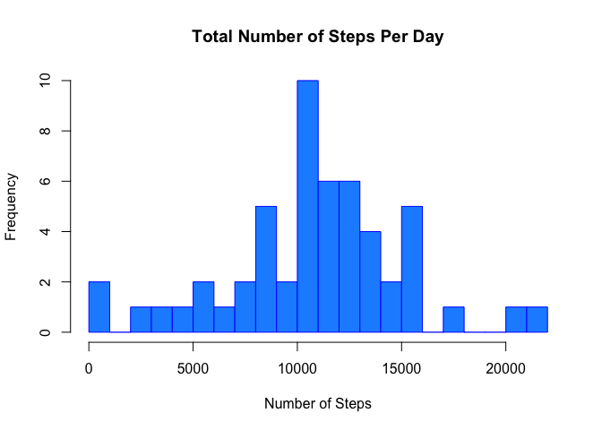
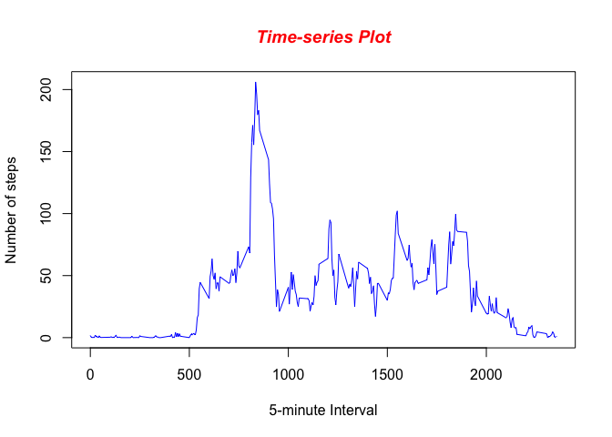
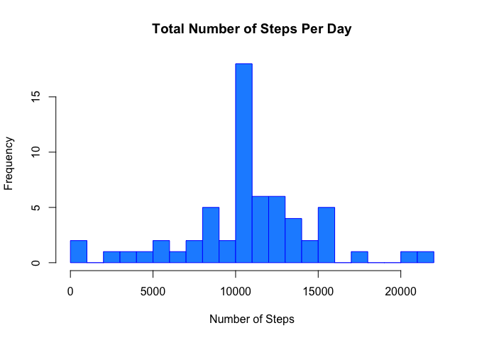
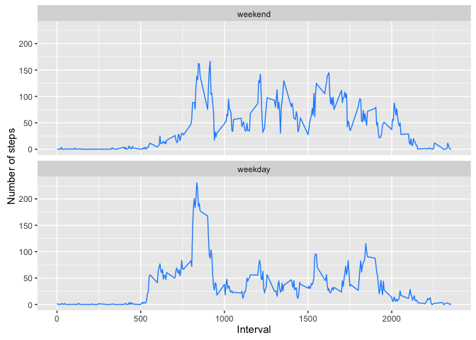

# Reproducible Research: Peer Assessment 1

## Introduction

This assignment makes use of data from a personal activity monitoring device. This device collects data at 5 minute intervals through out the day. The data consists of two months of data from an anonymous individual collected during the months of October and November, 2012 and include the number of steps taken in 5 minute intervals each day.

##Data Source

The variables included in this dataset are:

**steps:** Number of steps taking in a 5-minute interval (missing values are coded as 𝙽𝙰)

**date:** The date on which the measurement was taken in **YYYY-MM-DD** format

**interval:** Identifier for the 5-minute interval in which measurement was taken
The dataset is stored in a comma-separated-value (CSV) file and there are a total of **17,568** observations in this datas


## Loading and preprocessing the data


```r
unzip(zipfile="activity.zip")
data <- read.csv('activity.csv', header = TRUE)
```


## What is mean total number of steps taken per day?


```r
library(dplyr)

# sum the total number of steps for each day
total <- data %>%group_by(date) %>% summarise(steps = sum(steps))

# Mean of the total number of steps grouped by 5-min-interval
averages <- na.omit(data) %>%group_by(interval) %>% summarise(mean = mean(steps))

# Calculate the mean of total number of steps taken per day.
mean(total$steps, na.rm=TRUE)
```

```
## [1] 10766.19
```

```r
# Calculate the median of total number of steps taken per day.
median(total$steps, na.rm=TRUE)
```

```
## [1] 10765
```

```r
# Plot histogram of frequency of certain interval of steps. 

my.bin.width <- 1000

hist(total$steps, 
     plot = TRUE, 
     main = paste("Total Number of Steps Per Day"),
      xlab="Number of Steps", 
     border="blue", 
     breaks=seq(0,22000,by=my.bin.width),
     col="DodgerBlue")
```



## What is the average daily activity pattern?


```r
# Graph data using blue points overlayed by a line 
plot(averages$mean ~ averages$interval, type="l", col="blue",xlab="5-minute Interval",ylab="Number of steps")

# Create a title with a red, bold/italic font
title(main="Time-series Plot", col.main="red", font.main=4)
```



```r
# The 5-min interval with the max number of steps averaged over all days
averages[which.max(averages$mean),1]
```

```
## Source: local data frame [1 x 1]
## 
##   interval
##      (int)
## 1      835
```


## Imputing missing values

Calculate and report the total number of missing values in the dataset. 


```r
# sum the total no of row's with na (i.e missing)
sum(is.na(data$steps))
```

```
## [1] 2304
```

```r
# assign all missing value (na's) to a logical index vector
logical.index <- is.na(data$steps)

# create a vector of the mean steps for 5-min intervals across all days
# (matching all rows in data.na)
averages.na <- rep(averages$mean,61)

# Fill missing values with mean value for that 5-minute interval across all days

for (i in 1:nrow(data)) {
  if (logical.index[i] == TRUE) {
        data$steps[i] <- round(averages.na[i], digits = 1) # Round dec. places
         } 

}

# sum the total number of steps for each day
total.na <- na.omit(data) %>%group_by(date) %>% summarise(steps = sum(steps))


# Mean of the total number of steps grouped by 5-min-interval

averages.na <- na.omit(data) %>%group_by(interval) %>% summarise(mean = mean(steps))

# Plot histogram of frequency of certain interval of steps. 

my.bin.width <- 1000

hist(total.na$steps, 
     plot = TRUE, 
     main = paste("Total Number of Steps Per Day"),
      xlab="Number of Steps", 
     border="blue", 
     breaks=seq(0,22000,by=my.bin.width),
     col="DodgerBlue")
```



```r
# Calculate the mean of total number of steps taken per day.

mean(total.na$steps)
```

```
## [1] 10766.19
```

```r
# Calculate the median of total number of steps taken per day.

median(total.na$steps)
```

```
## [1] 10766.2
```
The value for mean after imputing the missing data is the same in as the original data. The median for the imputed missing data is now the same as the mean.

Imputing missing data for missing data increased the number of steps taken per day.


## Are there differences in activity patterns between weekdays and weekends?

It is apparent from our comparison graphs below that our participate is more sedentary during the weekdays through the middle part of the day compared to the weekends. Which may indicate that they have a sit down job role i.e office worker during the weekdays. 


```r
library(ggplot2)


weekdays <- c('Monday', 'Tuesday', 'Wednesday', 'Thursday', 'Friday')

# creates 2 level factor for weekday and weekend
data$wDay <- factor((weekdays(as.Date(data$date)) %in% weekdays), levels=c(FALSE, TRUE),
                       labels=c('weekend', 'weekday'))

# Mean of the total number of steps grouped by 5-min-interval (weekday versus weekend)
averages.na <- data %>%group_by(interval, wDay) %>% summarise(mean = mean(steps))


ggplot(averages.na, aes(interval,mean)) + geom_line(color="DodgerBlue") + facet_wrap(~wDay, nrow=2) + labs(x="Interval", y="Number of steps")
```




